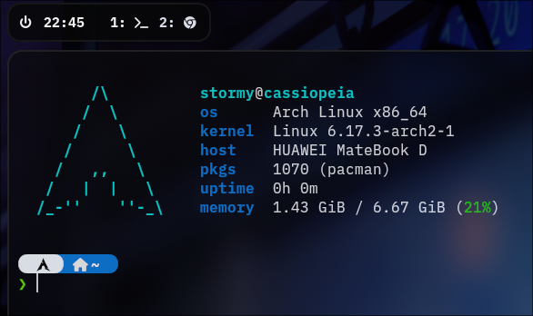

<h1 align="center">Dotfiles for Arch Linux</h1>



<h2 align="center">
  <a>
  <br>
  <div>
    <a href="https://github.com/stormyark/hyprland/issues">
        
    </a>
    <a href="https://github.com/stormyark/hyprland/stargazers">
        
    </a>
    <a href="https://github.com/stormyark/hyprland/">
        
    </a>
    <a href="https://github.com/stormyark/hyprland/blob/master/LICENSE">
        
    </a>
    <br>
  </div>
</h2>


Welcome to my custom dotfiles repository, built for minimal, modern, and functional **Arch Linux desktop setups** using [`Hyprland`](https://github.com/hyprwm/Hyprland), `waybar`, `kitty`, `rofi`, and many more.

This setup includes:

* Pre-configured system-wide tools and applications
* Beautiful theming
* Useful CLI scripts
* Automated installer
* Logical file structure for customization

---

## 📦 Features

* ⚡ **Fast installer** for all essential packages
* 🎨 Pre-configured Hyprland desktop with waybar, rofi, fastfetch, and more
* 🧰 Handy bash utilities (`wifi-connect`, `ask.sh`, `help-bash.sh`, etc.)
* 🖼️ Wallpapers + auto wallpaper cycler
* ✅ Built-in logging and confirmation handling
* 🧠 Modular and readable configuration

---

## 📁 Repository Structure

```bash
hyprland/
├── dot_config/
│   ├── brave-flags.conf        # Custom launch flags for Brave browser
│   ├── btop/                   # Config files for the btop system monitor
│   ├── cava/                   # Audio visualizer settings
│   ├── Code/                   # Settings for Visual Studio Code
│   ├── fastfetch/              # Config for fast system info tool (like neofetch)
│   ├── hypr/                   # Hyprland window manager configuration
│   ├── kitty/                  # Kitty terminal emulator configuration
│   ├── mako/                   # Wayland notification daemon settings
│   ├── ranger/                 # Config for ranger terminal file manager
│   ├── scripts/                # Custom utility scripts (e.g. shell scripts)
│   ├── spotify-flags.conf      # Launch flags for the Spotify client
│   ├── waybar/                 # Waybar config (status bar for Wayland compositors)
│   ├── wlogout/                # Config for logout menu (Wayland compatible)
│   └── rofi/                   # Rofi launcher settings
│
├── dot_nanorc                  # Configuration for nano text editor
│
├── dot_oh-my-zsh/              # Zsh framework – plugins, themes, core scripts, etc.
│   ├── cache/                  # Cached data to speed up shell start
│   ├── CODE_OF_CONDUCT.md      # Contribution behavior rules
│   ├── CONTRIBUTING.md         # Guidelines for contributing to oh-my-zsh
│   ├── custom/                 # Your custom plugins/themes for oh-my-zsh
│   ├── dot_devcontainer/       # Dev container settings (e.g. for VS Code remote)
│   ├── dot_editorconfig        # Project-wide editor formatting rules
│   ├── dot_git/                # Git metadata if oh-my-zsh is tracked as a repo
│   ├── dot_github/             # GitHub-related config (e.g. issue templates)
│   ├── dot_gitignore           # Files to exclude from Git tracking
│   ├── dot_gitpod.Dockerfile   # Docker setup for Gitpod dev environments
│   ├── dot_gitpod.yml          # Gitpod workspace configuration
│   ├── dot_prettierrc          # Prettier code formatting rules
│   ├── lib/                    # Core libraries used by oh-my-zsh
│   ├── LICENSE.txt             # License for oh-my-zsh
│   ├── log/                    # Log files generated by oh-my-zsh
│   ├── oh-my-zsh.sh            # Main script to initialize oh-my-zsh
│   ├── plugins/                # Official plugins
│   ├── README.md               # Readme for oh-my-zsh
│   ├── SECURITY.md             # Security policy for oh-my-zsh
│   ├── templates/              # File templates (e.g. `.zshrc` examples)
│   ├── themes/                 # Theme definitions (prompt styles, etc.)
│   └── tools/                  # Utility tools bundled with oh-my-zsh
│
├── dot_p10k.zsh                # Powerlevel10k prompt theme config
│
├── dot_themes/                 # Custom GTK or shell themes
│   ├── Andromeda-dark/         # Dark version of Andromeda theme
│   └── Andromeda-gtk/          # GTK-compatible version of Andromeda
│
├── dot_tmux.conf               # Configuration for tmux terminal multiplexer
├── dot_zshrc                   # Main zsh shell configuration file
├── howtoinstallarch.md         # Arch Linux installation guide
├── installedpackages.md        # List of installed packages
├── preview/                    # screenshots from this configs
└── README.md
```

---

## ⚙️ Installation

### 🔧 1. Prerequisites

* Arch Linux system (clean recommended)
* Internet connection
* `git` installed (`sudo pacman -S git`)
* `stow` installed (`sudo pacman -S stow`)

### 🚀 2. Clone the Repository

```bash
git clone https://github.com/stormyark/hyprland.git ~/hyprland
cd ~/hyprland/installer
stow --adopt .
sudo pacman -S --needed - < pkglist.txt
```

### ▶️ 3. Run the Installer

```bash
chmod +x install.sh
sudo ./install.sh
```

This script will:

1. Check root and OS
2. Prompt you for actions
3. Install all packages
4. Set up YAY (AUR helper)
5. Copy dotfiles and configs
6. Install helper scripts to `~/.local/bin`
7. Configure wallpapers and theming

---

## ✅ After Installation

Once everything is installed:

* You can **start Hyprland** using:

  ```bash
  start
  ```

* All **scripts** are available via:

  ```bash
  ~/.local/bin/script-name.sh
  ```

* **Wallpapers** are stored in:

  ```bash
  ~/Pictures/Wallpapers/
  ```

* **Config files** are located in:

  ```bash
  ~/.config/
  ```

* **Shell configs** and `.xinitrc` are in your home:

  ```bash
  ~/.bashrc, ~/.xinitrc, ~/.bash_profile
  ```

---

## 🤝 FAQ

### ❓ Can I use this on other distros?

While it’s optimized for **Arch Linux**, many configs will work elsewhere — but the installer and package setup is Arch-specific.

### 🛠 How to customize my setup?

Just edit the files in:

* `~/.config/`
* `~/.bashrc`, `~/.xinitrc`, `~/.local/bin/`

Theme settings can be changed using `qt5ct`, `nwg-look`, and `gtk-settings`.

---

## ✨ Credits

**Created by:** [stormyark](https://github.com/stormyark)

* 🔗 Website: [stormyark.de](https://stormyark.de)

---

## ❤️ Contribute or Fork

Feel free to fork this repository, modify it for your setup, and star it if you found it helpful.

---

## 🚀 License

This project is under the **MIT License**. Use it freely, but give credit where it’s due!
